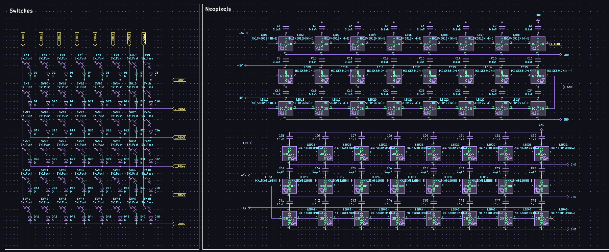
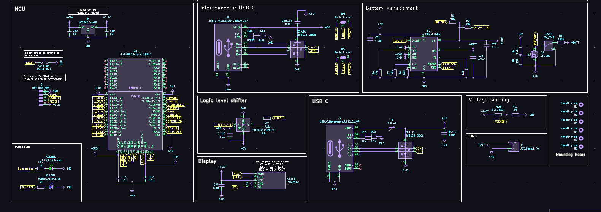
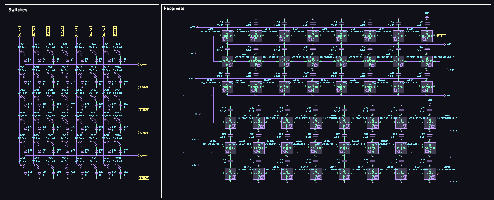
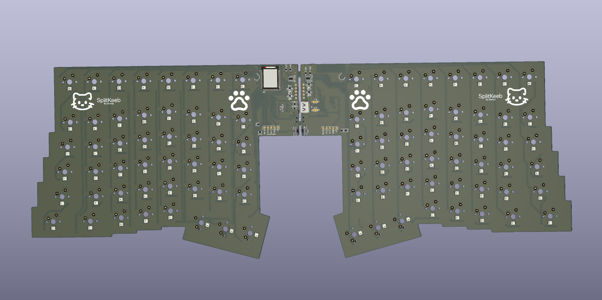
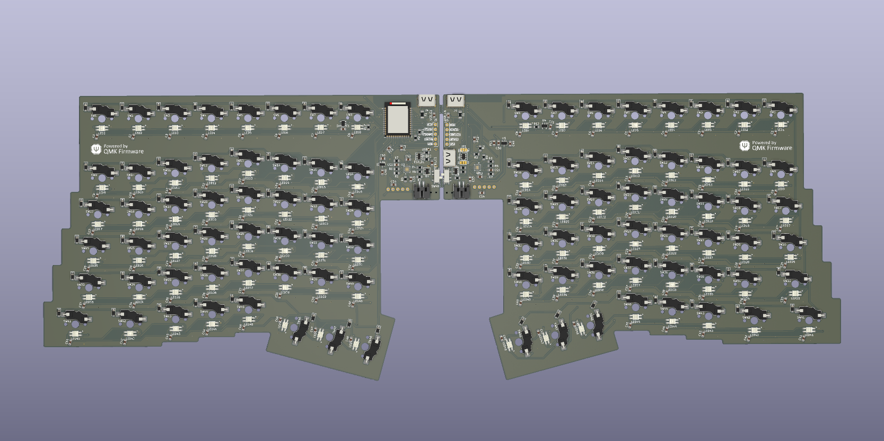
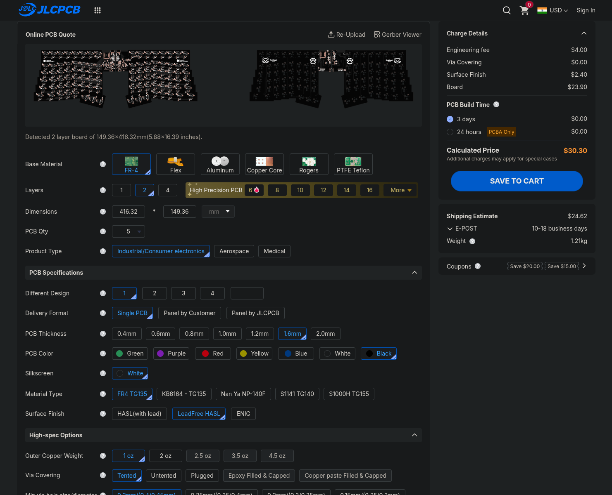

# SplitKeeb

A split keyboard for my daily use.

## CAD

will be updated soon.

## PCB

Schematics Left 

Schematics Right 

Renders 

JLC order

## Firmware

Firmware available at [firmware/](firmware/) firmware will be tweaked and
created after i get the materials/get approved.

### Bill of Materials

Checkout [BOM.csv](bom/SplitKeeb.csv)
